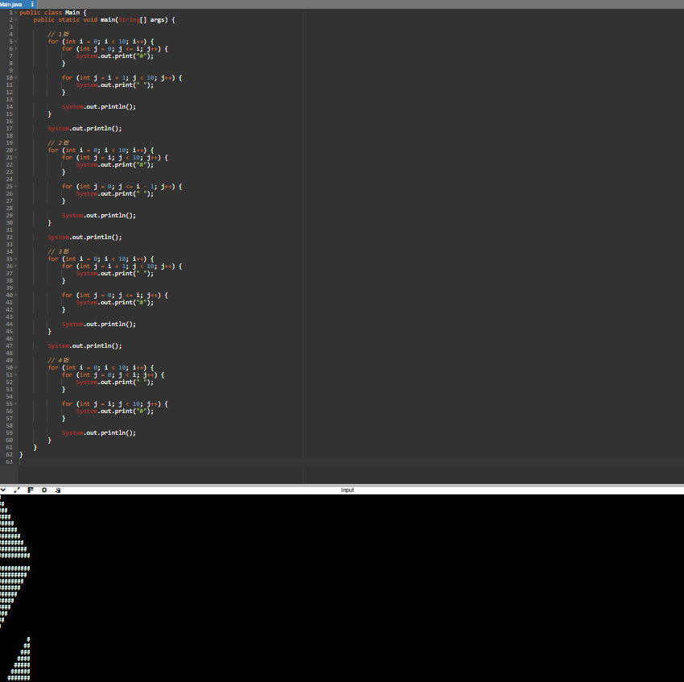
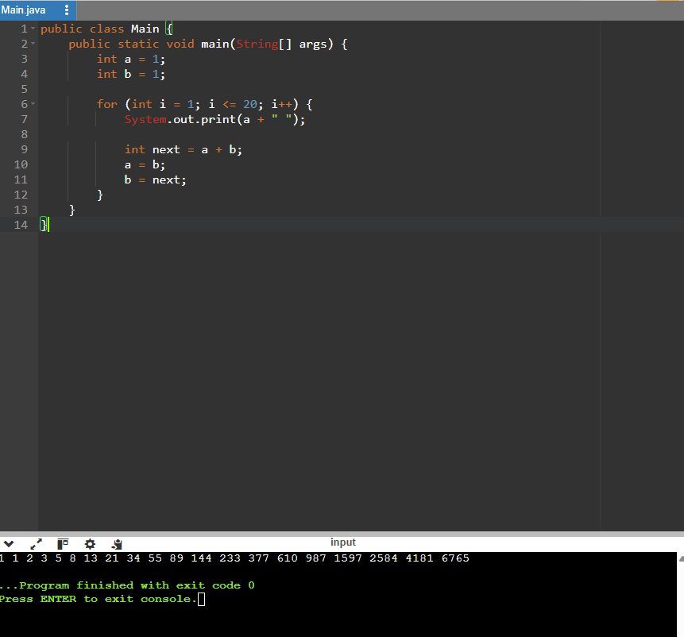
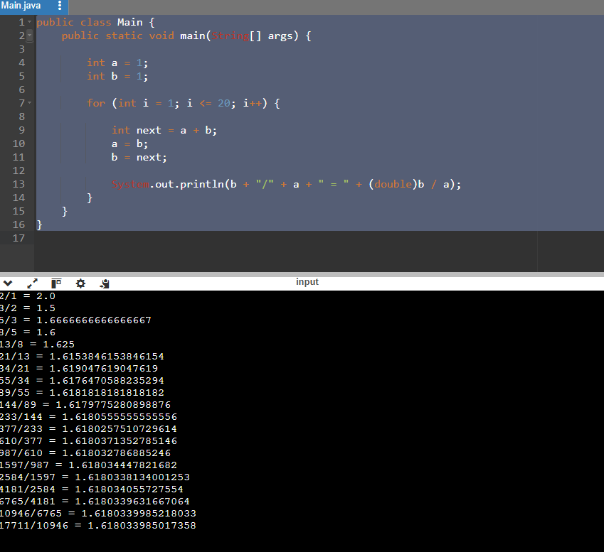
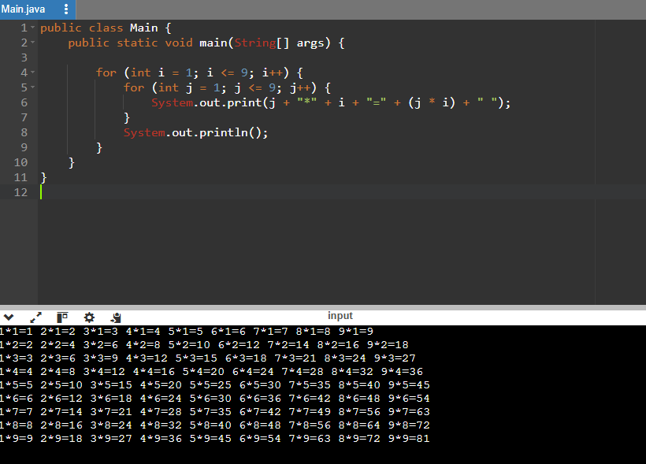
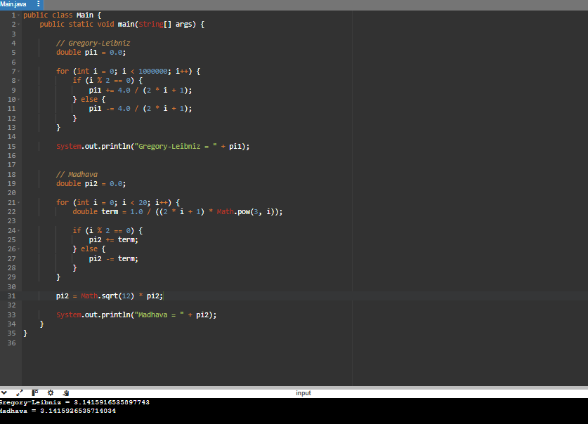
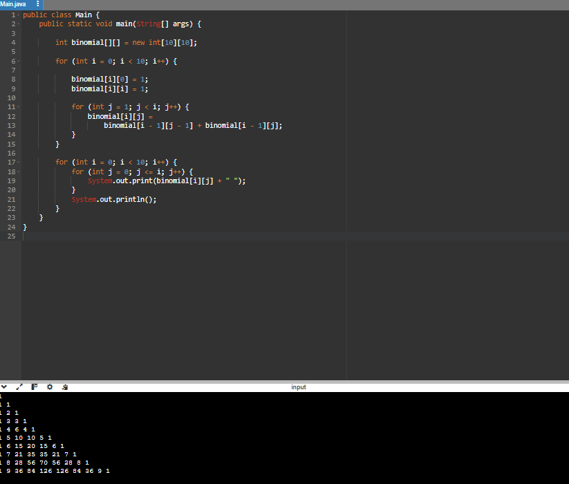
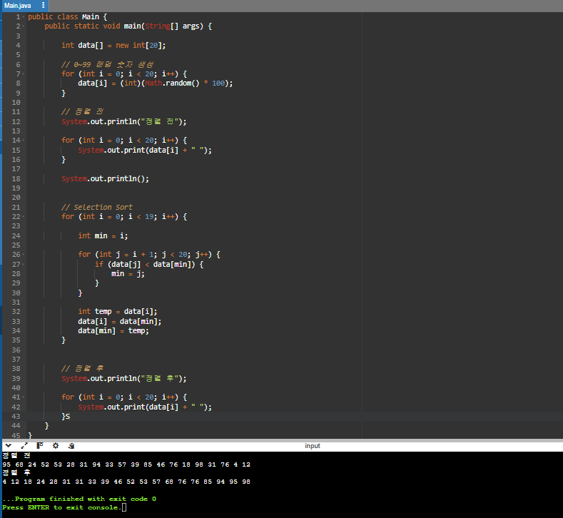
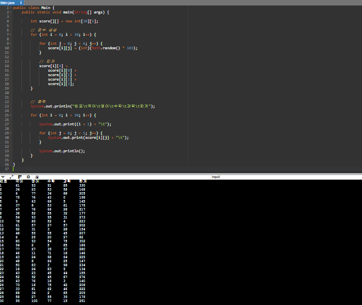

# OOP2026
### Homework1
```java
class triangle {
    public static void main(String[] args) {
        for (int i=0; i<10; i++){
            for(int j=0; j<=i; j++){
                System.out.print("#");
            }
            for(int j=i+1; j<10;j++){
                System.out.print(" ");
            }
            System.out.println();
        }
        System.out.println();

        for (int i=0; i<10; i++){
            for(int j=i; j<10; j++){
                System.out.print("#");
            }
            for(int j=0; j<=i-1; j++){
                System.out.print(" ");
            }
            System.out.println();
        }
        System.out.println();

        for (int i=0; i<10; i++){
            for(int j=i+1; j<10; j++){
                System.out.print(" ");
            }
            for(int j=0; j<=i; j++){
                System.out.print("#");
            }
            System.out.println();
        }
        System.out.println();

        for (int i=0; i<10; i++){
            for(int j=0; j<i; j++){
                System.out.print(" ");
            }
            for(int j=i; j<10; j++){
                System.out.print("#");
            }
            System.out.println();
        }    
    }
}

```



### Homework2
```java
public class Main {
    public static void main(String[] args) {
        int a = 1;
        int b = 1;

        for (int i = 1; i <= 20; i++) {
            System.out.print(a + " ");

            int next = a + b;
            a = b;
            b = next;
        }
    }
}

```


### Homework3
```java
public class Main {
    public static void main(String[] args) {

        int a = 1;
        int b = 1;

        for (int i = 1; i <= 20; i++) {

            int next = a + b;
            a = b;
            b = next;

            System.out.println(b + "/" + a + " = " + (double)b / a);
        }
    }
}

```


### Homework4
```java
public class Main {
    public static void main(String[] args) {

        for (int i = 1; i <= 9; i++) {
            for (int j = 1; j <= 9; j++) {
                System.out.print(j + "*" + i + "=" + (j * i) + " ");
            }
            System.out.println();
        }
    }
}

```


### Homework5
```java
public class Main {
    public static void main(String[] args) {

        // Gregory-Leibniz
        double pi1 = 0.0;

        for (int i = 0; i < 1000000; i++) {
            if (i % 2 == 0) {
                pi1 += 4.0 / (2 * i + 1);
            } else {
                pi1 -= 4.0 / (2 * i + 1);
            }
        }

        System.out.println("Gregory-Leibniz = " + pi1);


        // Madhava
        double pi2 = 0.0;

        for (int i = 0; i < 20; i++) {
            double term = 1.0 / ((2 * i + 1) * Math.pow(3, i));

            if (i % 2 == 0) {
                pi2 += term;
            } else {
                pi2 -= term;
            }
        }

        pi2 = Math.sqrt(12) * pi2;

```


### Homework6
```java
        System.out.println("Madhava = " + pi2);
    }
}public class Main {
    public static void main(String[] args) {

        int binomial[][] = new int[10][10];

        for (int i = 0; i < 10; i++) {

            binomial[i][0] = 1;
            binomial[i][i] = 1;

            for (int j = 1; j < i; j++) {
                binomial[i][j] =
                    binomial[i - 1][j - 1] + binomial[i - 1][j];
            }
        }

        for (int i = 0; i < 10; i++) {
            for (int j = 0; j <= i; j++) {
                System.out.print(binomial[i][j] + " ");
            }
            System.out.println();
        }
    }
}

```


### Homework7
```java
public class Main {
    public static void main(String[] args) {

        int data[] = new int[20];

        // 0~99 랜덤 숫자 생성
        for (int i = 0; i < 20; i++) {
            data[i] = (int)(Math.random() * 100);
        }

        // 정렬 전
        System.out.println("정렬 전");

        for (int i = 0; i < 20; i++) {
            System.out.print(data[i] + " ");
        }

        System.out.println();


        // Selection Sort
        for (int i = 0; i < 19; i++) {

            int min = i;

            for (int j = i + 1; j < 20; j++) {
                if (data[j] < data[min]) {
                    min = j;
                }
            }

            int temp = data[i];
            data[i] = data[min];
            data[min] = temp;
        }


        // 정렬 후
        System.out.println("정렬 후");

        for (int i = 0; i < 20; i++) {
            System.out.print(data[i] + " ");
        }
    }
}

```


### Homework8
```java
public class Main {
    public static void main(String[] args) {

        int score[][] = new int[30][5];

        // 점수 생성
        for (int i = 0; i < 30; i++) {

            for (int j = 0; j < 4; j++) {
                score[i][j] = (int)(Math.random() * 101);
            }

            // 합계
            score[i][4] =
                score[i][0] +
                score[i][1] +
                score[i][2] +
                score[i][3];
        }


        // 출력
        System.out.println("번호\t국어\t영어\t수학\t과학\t합계");

        for (int i = 0; i < 30; i++) {

            System.out.print((i + 1) + "\t");

            for (int j = 0; j < 5; j++) {
                System.out.print(score[i][j] + "\t");
            }

            System.out.println();
        }
    }
}

```

