# OOP2026
### Homework1
```java
class triangle {
    public static void main(String[] args) {
        for (int i=0; i<10; i++){
            for(int j=0; j<=i; j++){
                System.out.print("#");
            }
            for(int j=i+1; j<10;j++){
                System.out.print(" ");
            }
            System.out.println();
        }
        System.out.println();

        for (int i=0; i<10; i++){
            for(int j=i; j<10; j++){
                System.out.print("#");
            }
            for(int j=0; j<=i-1; j++){
                System.out.print(" ");
            }
            System.out.println();
        }
        System.out.println();

        for (int i=0; i<10; i++){
            for(int j=i+1; j<10; j++){
                System.out.print(" ");
            }
            for(int j=0; j<=i; j++){
                System.out.print("#");
            }
            System.out.println();
        }
        System.out.println();

        for (int i=0; i<10; i++){
            for(int j=0; j<i; j++){
                System.out.print(" ");
            }
            for(int j=i; j<10; j++){
                System.out.print("#");
            }
            System.out.println();
        }    
    }
}

```

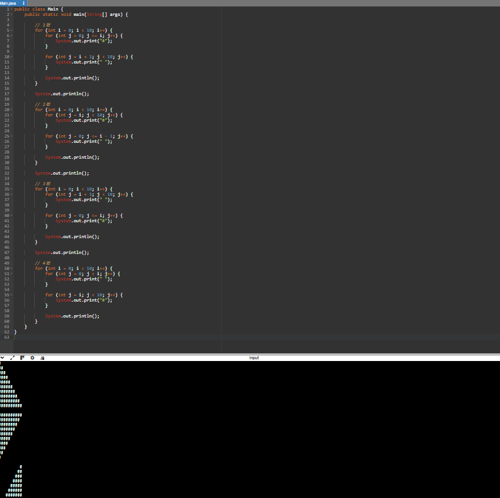

### Homework2
```java
public class Main {
    public static void main(String[] args) {
        int a = 1;
        int b = 1;

        for (int i = 1; i <= 20; i++) {
            System.out.print(a + " ");

            int next = a + b;
            a = b;
            b = next;
        }
    }
}

```
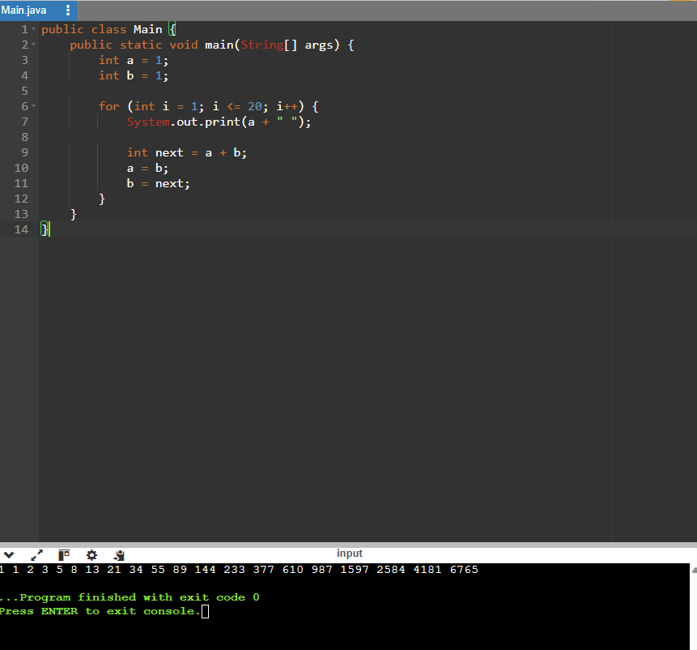

### Homework3
```java
public class Main {
    public static void main(String[] args) {

        int a = 1;
        int b = 1;

        for (int i = 1; i <= 20; i++) {

            int next = a + b;
            a = b;
            b = next;

            System.out.println(b + "/" + a + " = " + (double)b / a);
        }
    }
}

```
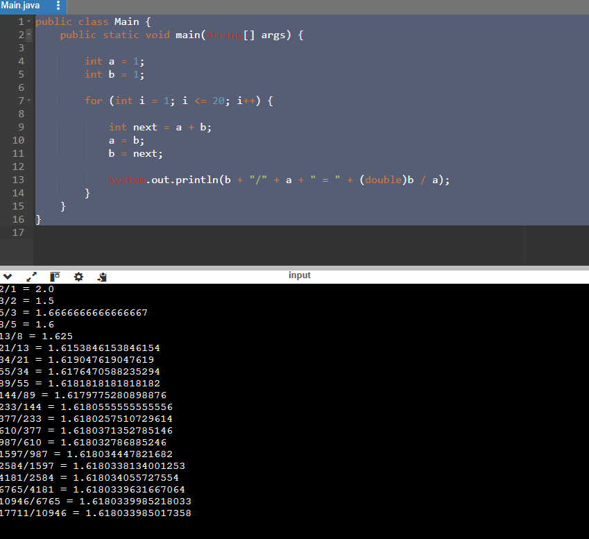

### Homework4
```java
public class Main {
    public static void main(String[] args) {

        for (int i = 1; i <= 9; i++) {
            for (int j = 1; j <= 9; j++) {
                System.out.print(j + "*" + i + "=" + (j * i) + " ");
            }
            System.out.println();
        }
    }
}

```
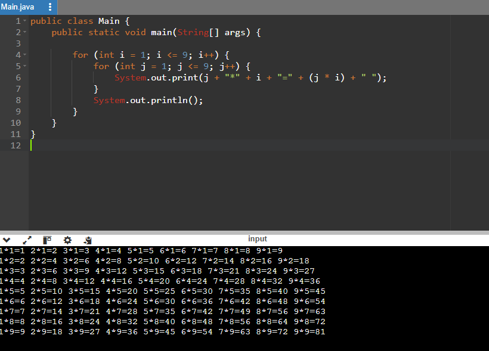

### Homework5
```java
public class Main {
    public static void main(String[] args) {

        // Gregory-Leibniz
        double pi1 = 0.0;

        for (int i = 0; i < 1000000; i++) {
            if (i % 2 == 0) {
                pi1 += 4.0 / (2 * i + 1);
            } else {
                pi1 -= 4.0 / (2 * i + 1);
            }
        }

        System.out.println("Gregory-Leibniz = " + pi1);


        // Madhava
        double pi2 = 0.0;

        for (int i = 0; i < 20; i++) {
            double term = 1.0 / ((2 * i + 1) * Math.pow(3, i));

            if (i % 2 == 0) {
                pi2 += term;
            } else {
                pi2 -= term;
            }
        }

        pi2 = Math.sqrt(12) * pi2;

```
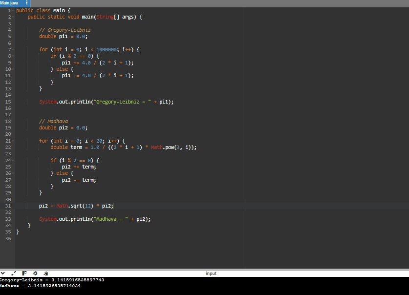

### Homework6
```java
        System.out.println("Madhava = " + pi2);
    }
}public class Main {
    public static void main(String[] args) {

        int binomial[][] = new int[10][10];

        for (int i = 0; i < 10; i++) {

            binomial[i][0] = 1;
            binomial[i][i] = 1;

            for (int j = 1; j < i; j++) {
                binomial[i][j] =
                    binomial[i - 1][j - 1] + binomial[i - 1][j];
            }
        }

        for (int i = 0; i < 10; i++) {
            for (int j = 0; j <= i; j++) {
                System.out.print(binomial[i][j] + " ");
            }
            System.out.println();
        }
    }
}

```
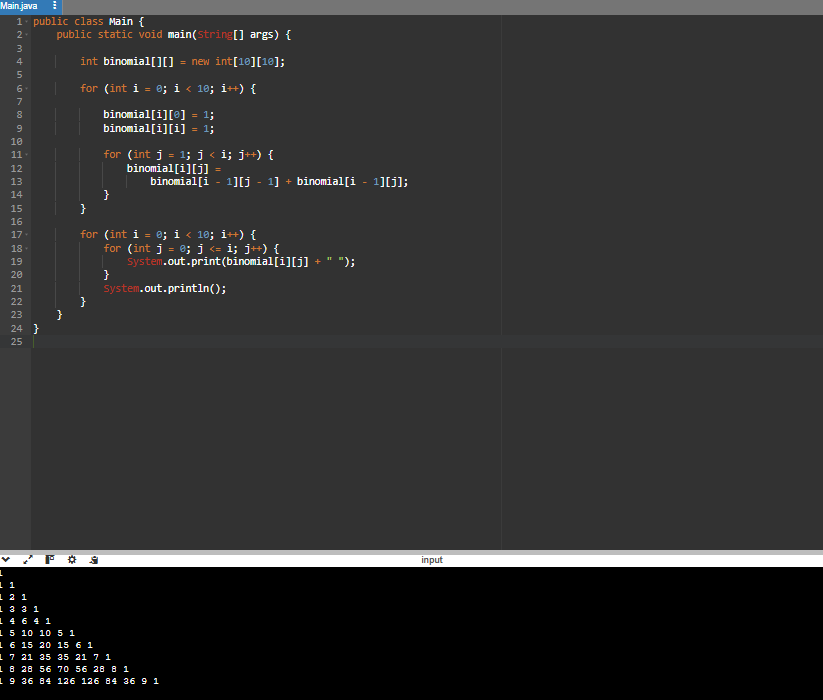

### Homework7
```java
public class Main {
    public static void main(String[] args) {

        int data[] = new int[20];

        // 0~99 랜덤 숫자 생성
        for (int i = 0; i < 20; i++) {
            data[i] = (int)(Math.random() * 100);
        }

        // 정렬 전
        System.out.println("정렬 전");

        for (int i = 0; i < 20; i++) {
            System.out.print(data[i] + " ");
        }

        System.out.println();


        // Selection Sort
        for (int i = 0; i < 19; i++) {

            int min = i;

            for (int j = i + 1; j < 20; j++) {
                if (data[j] < data[min]) {
                    min = j;
                }
            }

            int temp = data[i];
            data[i] = data[min];
            data[min] = temp;
        }


        // 정렬 후
        System.out.println("정렬 후");

        for (int i = 0; i < 20; i++) {
            System.out.print(data[i] + " ");
        }
    }
}

```
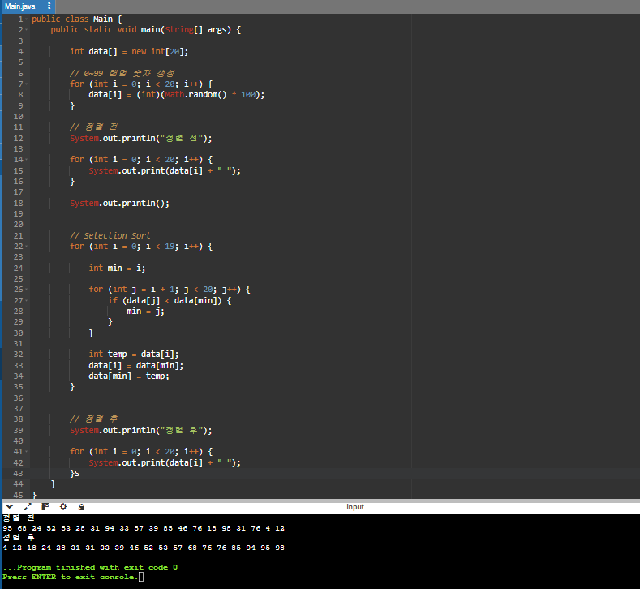

### Homework8
```java
public class Main {
    public static void main(String[] args) {

        int score[][] = new int[30][5];

        // 점수 생성
        for (int i = 0; i < 30; i++) {

            for (int j = 0; j < 4; j++) {
                score[i][j] = (int)(Math.random() * 101);
            }

            // 합계
            score[i][4] =
                score[i][0] +
                score[i][1] +
                score[i][2] +
                score[i][3];
        }


        // 출력
        System.out.println("번호\t국어\t영어\t수학\t과학\t합계");

        for (int i = 0; i < 30; i++) {

            System.out.print((i + 1) + "\t");

            for (int j = 0; j < 5; j++) {
                System.out.print(score[i][j] + "\t");
            }

            System.out.println();
        }
    }
}

```
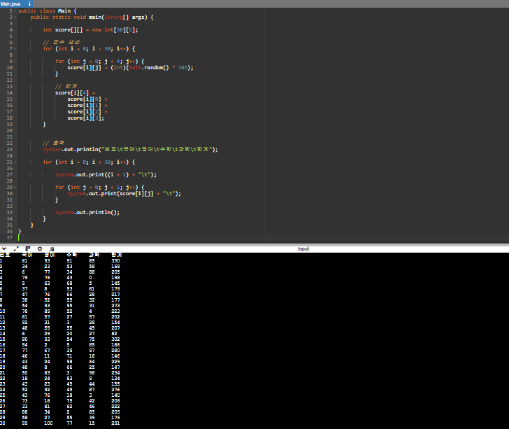

### Homework9
(1.75)₁₀   = (1.11)₂
(1.625)₁₀  = (1.101)₂
(1.5625)₁₀ = (1.1001)₂
(1.875)₁₀  = (1.111)₂
(13.875)₁₀ = (1101.111)₂
(45.875)₁₀ = (101101.111)₂

### Homework10
```java
import java.util.Scanner;

public class Main {
    public static void main(String[] args) {
        Scanner sc = new Scanner(System.in);
        
        int array_count = sc.nextInt();
        int max_value = sc.nextInt();
        int bin_size = sc.nextInt();
        int display_scale = sc.nextInt();
        
        int hist_size = max_value / bin_size;
        
        int[] arr = new int[array_count];
        int[] hist = new int[hist_size];
        
        for (int i = 0; i < array_count; i++) {
            arr[i] = (int) (Math.random() * max_value);
        }
        
        for (int i = 0; i < array_count; i++) {
            hist[arr[i] / bin_size]++;
        }
        
        for (int i = 0; i < hist_size; i++) {
            int start = i * bin_size;
            int end = (i + 1) * bin_size - 1;
            
            System.out.printf("%2d~%2d\t", start, end);
            
            int count = hist[i] / display_scale;
            for (int j = 0; j < count; j++) {
                System.out.print("#");
            }
            System.out.println();
        }
        
        sc.close();
    }
}

```
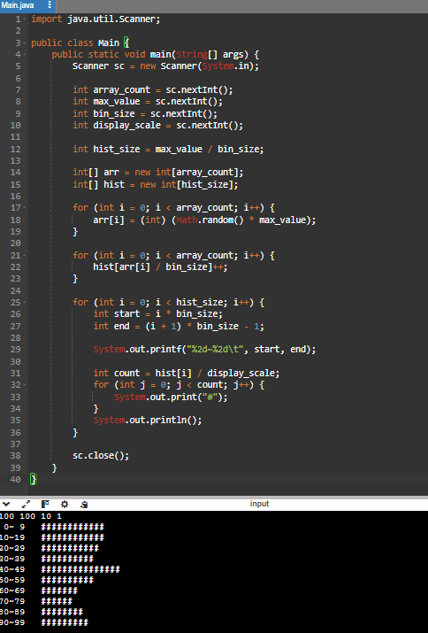

### Homework11
```java
import java.util.Arrays;
import java.util.Scanner;

public class Main {
    public static void main(String[] args) {
        Scanner sc = new Scanner(System.in);
        
        System.out.print("데이터 개수 입력: ");
        int array_count = sc.nextInt();
        
        int[] arr = new int[array_count];
        
   
        for (int i = 0; i < array_count; i++) {
            arr[i] = (int) (Math.random() * 100) + 1;
        }
        
    
        System.out.print("생성된 데이터: ");
        for (int i = 0; i < array_count; i++) {
            System.out.print(arr[i] + " ");
        }
        System.out.println("\n");
        
    
        double sum = 0;
        for (int i = 0; i < array_count; i++) {
            sum += arr[i];
        }
        double arithmeticMean = sum / array_count;
        
    
        double prod = 1.0;
        for (int i = 0; i < array_count; i++) {
            prod *= arr[i];
        }
        double geometricMean = Math.pow(prod, 1.0 / array_count);
        
      
        double harmonicSum = 0;
        for (int i = 0; i < array_count; i++) {
            harmonicSum += 1.0 / arr[i];
        }
        double harmonicMean = array_count / harmonicSum;
        
      
        int[] sortedArr = arr.clone();
        Arrays.sort(sortedArr);
        double median;
        if (array_count % 2 == 1) {
            median = sortedArr[array_count / 2];
        } else {
            median = (sortedArr[array_count / 2 - 1] + sortedArr[array_count / 2]) / 2.0;
        }
        
      
        System.out.println("=== [통계 계산 결과] ===");
        System.out.printf("산술평균 (Arithmetic Mean) : %.4f\n", arithmeticMean);
        System.out.printf("기하평균 (Geometric Mean)  : %.4f\n", geometricMean);
        System.out.printf("조화평균 (Harmonic Mean)   : %.4f\n", harmonicMean);
        System.out.printf("중앙값 (Median)            : %.4f\n", median);
        
        sc.close();
    }
}

```
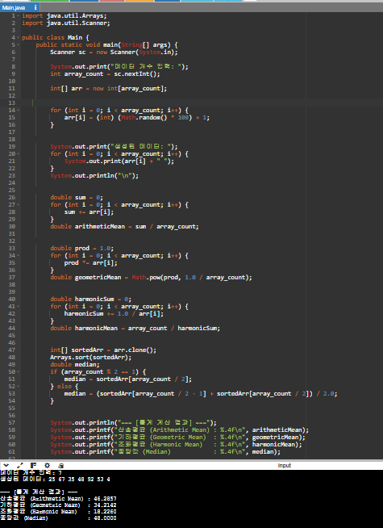

### Homework13
```java
import java.util.Scanner;

public class Main {
    public static void main(String[] args) {
        Scanner scanner = new Scanner(System.in);

        while (true) {
            String inputString = scanner.nextLine();

            String[] arrOfStr = inputString.split(" ");

            int result = Integer.parseInt(arrOfStr[0]);

            for (int i = 1; i < arrOfStr.length; i += 2) {
                String operator = arrOfStr[i];
                int number = Integer.parseInt(arrOfStr[i + 1]);

                
                if (operator.equals("#")) {
                    operator = "*";
                }

                if (operator.equals("+")) {
                    result = result + number;
                }
                else if (operator.equals("-")) {
                    result = result - number;
                }
                else if (operator.equals("*")) {
                    result = result * number;
                }
                else if (operator.equals("/")) {
                    result = result / number;
                }
            }

            System.out.println(result);
        }
    }
}
```
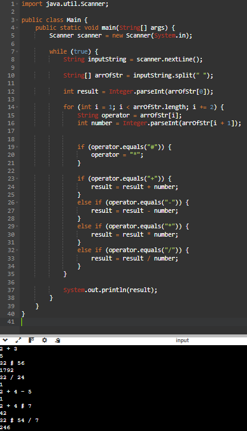


### Homework14
```java
import java.util.Arrays;

public class Main {

    static class Numbers {
        int num[];

        Numbers(int num[]) {
            this.num = num;
        }

      
        double getTotal() {
            double sum = 0;

            for (int i = 0; i < num.length; i++) {
                sum += num[i];
            }

            return sum;
        }

    
        double getArithmaticMean() {
            return getTotal() / num.length;
        }

     
        double getHarmonicMean() {
            double sum = 0;

            for (int i = 0; i < num.length; i++) {
                if (num[i] != 0) {
                    sum += 1.0 / num[i];
                }
            }

            return num.length / sum;
        }

      
        double getGeometricMean() {
            double product = 1.0;

            for (int i = 0; i < num.length; i++) {
                product *= num[i];
            }

            return Math.pow(product, 1.0 / num.length);
        }

     
        int getMedian() {
            sorting();

            int middle = num.length / 2;

            if (num.length % 2 == 1) {
                return num[middle];
            }
            else {
                return (num[middle - 1] + num[middle]) / 2;
            }
        }

        
        void sorting() {
            Arrays.sort(num);
        }

      
        void drawHistogram(int start, int end, int binCount) {

            int[] frequency = new int[binCount];

            double interval = (double)(end - start) / binCount;

          
            for (int i = 0; i < num.length; i++) {

                if (num[i] >= start && num[i] < end) {

                    int index = (int)((num[i] - start) / interval);

                    if (index >= 0 && index < binCount) {
                        frequency[index]++;
                    }
                }
            }

            System.out.println();
            System.out.println("도수분포표");
            System.out.println("-----------------------------");

            for (int i = 0; i < binCount; i++) {

                int binStart = (int)(start + i * interval);
                int binEnd = (int)(start + (i + 1) * interval);

                System.out.printf("%2d ~ %2d : ", binStart, binEnd - 1);

                for (int j = 0; j < frequency[i]; j++) {
                    System.out.print("*");
                }

                System.out.println(" (" + frequency[i] + ")");
            }

            System.out.println("-----------------------------");
        }


        void display() {
            System.out.printf("%3d :", num.length);

            for (int i = 0; i < num.length; i++) {
                System.out.printf("%3d ", num[i]);
            }

            System.out.println();
        }
    }


    public static void main(String[] args) {

        int size = 100;

        int data[] = new int[size];

     
        for (int i = 0; i < size; i++) {
            data[i] = (int)(Math.random() * 100);
        }

        Numbers obj = new Numbers(data);

        
        obj.display();

        
        System.out.printf("Arithmetic Mean : %5.2f\n",
                obj.getArithmaticMean());

        System.out.printf("Geometric Mean  : %5.2f\n",
                obj.getGeometricMean());

        System.out.printf("Harmonic Mean   : %5.2f\n",
                obj.getHarmonicMean());

        System.out.printf("Median          : %d\n",
                obj.getMedian());

       
        obj.drawHistogram(0, 100, 10);
    }
}

```
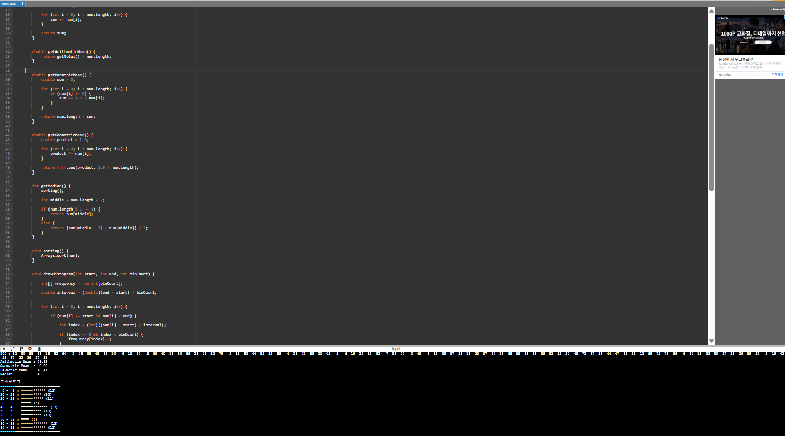
